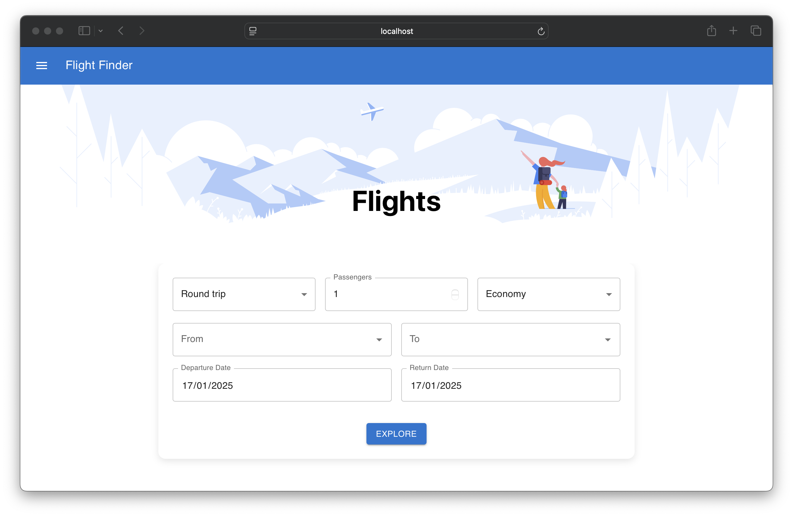
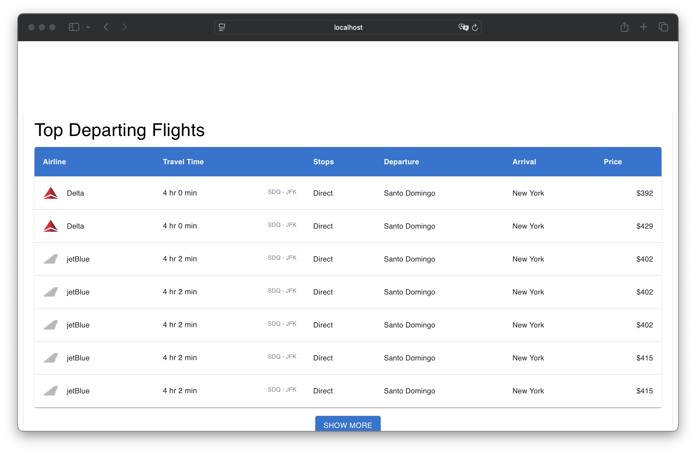

# Flight Finder

**Flight Finder** is a web application designed to simplify flight searches by allowing users to input travel details such as departure location, destination, and travel dates. The app fetches real-time data using the Sky Scrapper API and displays results in a table, including flight duration, ticket cost, departure country, and destination country. With its user-friendly interface and efficient data retrieval, Flight Finder is an ideal tool for effortless trip planning.

## Key Features

**Dynamic Searchbox:** Includes multiple input fields for users to provide detailed travel data, such as:

- Trip type (one-way or round-trip).
- Number of passengers.
- Travel class (Economy, First Class, etc.).
- Departure and destination airports.
- Date range selection using two date pickers.

**Flight Results Table:** Displays detailed flight information, including:

- Airline name and logo.
- Flight duration.
- Layover details (if applicable).
- Departure and destination cities.
- Ticket price.
  This combination of features provides users with a - comprehensive and visually appealing experience for finding flights tailored to their needs.

## Screenshots





## Tech Stack

**Client:** HTML, CSS, ModuleCSS, JavaScript, JSX, React, Vite, NPM, MaterialUI

## Prerequisites

Before you begin, ensure you have the following installed:

- **Node.js**: Team Organizer requires Node.js to run. You can download it from [nodejs.org](https://nodejs.org/).
- **Visual Studio Code (optional)**: You can download it from [Visual Studio Code](https://code.visualstudio.com/).

## Installation Steps

### Download the project:

1. Download the project from the repository or directly as a ZIP file.

### Clone the repository (alternative):

1. Clone the repository to your local machine:

   ```bash
   git clone https://github.com/jorgedoiany/flight-finde.git

   ```

2. Navigate into the project directory:

   ```bash
   cd flight-finder
   ```

### Install dependencies:

1. Install the necessary dependencies using npm:

   ```bash
   npm install

   ```

## Running The Application

### Start the development server:

1. To start Flight Finder App in development mode, run:

   ```bash
   npm run dev

   ```

2. Open your browser and navigate to http://localhost:5173/ to view Flight Finder.

## Additional Notes

- Ensure Node.js is installed globally on your machine.
- Visual Studio Code is optional but recommended for editing the codebase.
- Download the project directly as a ZIP file from the repository if preferred.
- This project uses Vite as the build tool and npm to manage dependencies and run scripts.
- For more information on json-server, visit [json-server](https://github.com/typicode/json-server).
- For more information on Vite, visit [vitejs.dev](https://vitejs.dev/).

That's it! You should now be able to see and use the **Flight Finder** in your browser.

## Author

- [@jorgedoiany](https://github.com/jorgedoiany)
